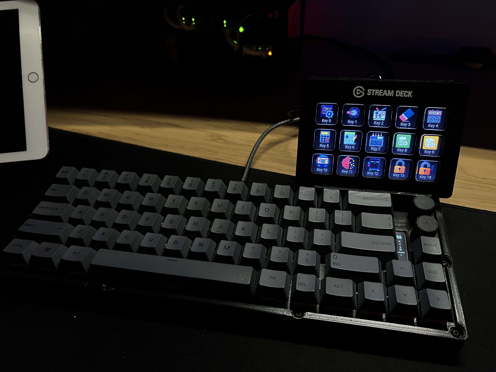
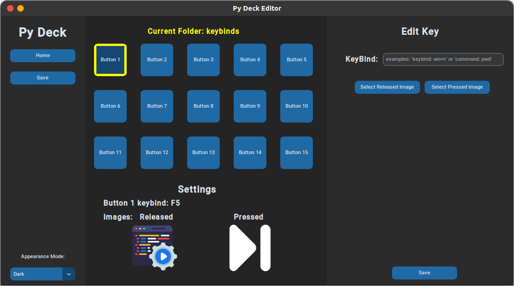

# Python Elgato Stream Deck GUI




This is a Front-End implementation of the open source library written for the [Stream Deck](https://www.elgato.com/en/gaming/stream-deck).
_________________

[PyPi Project Entry](https://pypi.org/project/streamdeck/) - [Online Documentation](https://python-elgato-streamdeck.readthedocs.io) - [Source Code](https://github.com/abcminiuser/python-elgato-streamdeck)


## Project Status:

Working - you can set up both keybinds and command line commands
Currently the following StreamDeck products are supported in only the StreamDeck Original:

## Package Installation:

Manually clone the project repository:
```
git clone git@github.com:Logan-Fouts/python-elgato-streamdeck.git
```

Run The GUI with python to setup the Deck:
```
python3 new_gui.py
```
## Credits:

Thank you to the following contributors, large and small, for helping with the
development and maintenance of this library:

- [Aetherdyne](https://github.com/Aetherdyne)
- [BS-Tek](https://github.com/BS-Tek)
- [dirkk0](https://github.com/dirkk0)
- [dodgyrabbit](https://github.com/dodgyrabbit)
- [dubstech](https://github.com/dubstech)
- [impala454](https://github.com/impala454)
- [jakobbuis](https://github.com/jakobbuis)
- [jmudge14](https://github.com/jmudge14)
- [Kalle-Wirsch](https://github.com/Kalle-Wirsch)
- [Lewiscowles1986](https://github.com/Lewiscowles1986)
- [m-weigand](https://github.com/m-weigand)
- [matrixinius](https://github.com/matrixinius)
- [phillco](https://github.com/phillco)
- [pointshader](https://github.com/pointshader)
- [shanna](https://github.com/shanna)
- [spidererrol](https://github.com/Spidererrol)
- [spyoungtech](https://github.com/spyoungtech)
- [Subsentient](https://github.com/Subsentient)
- [swedishmike](https://github.com/swedishmike)
- [theslimshaney](https://github.com/theslimshaney)

## License:

Released under the [MIT license](LICENSE).
